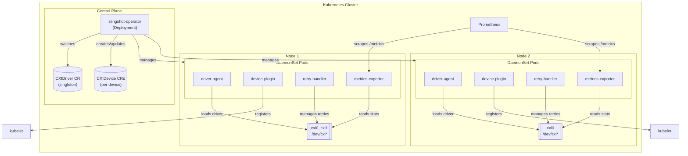
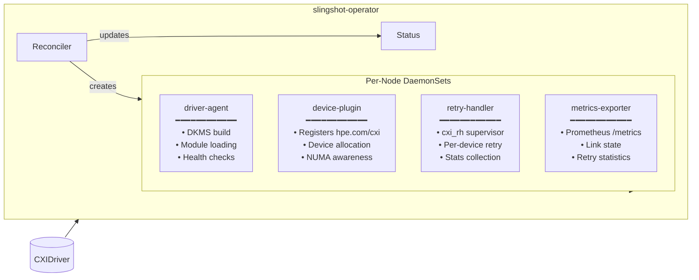
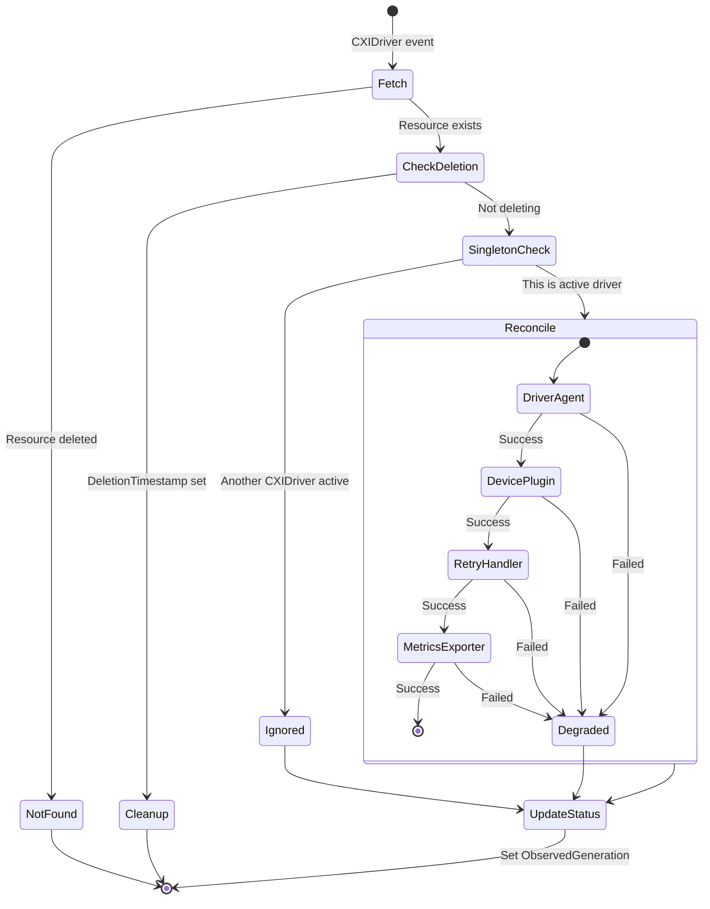
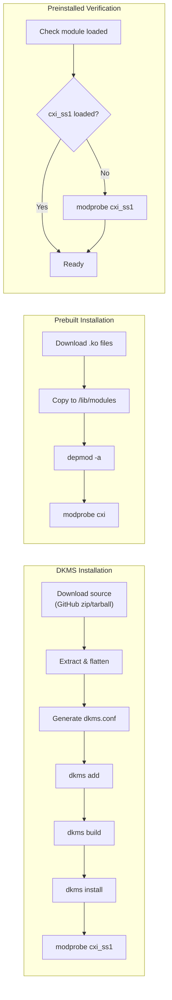

# Slingshot Operator

[](https://github.com/sielicki/slingshot-operator/actions/workflows/test.yml)
[](https://codecov.io/gh/sielicki/slingshot-operator)
[](https://goreportcard.com/report/github.com/sielicki/slingshot-operator)

A Kubernetes operator for managing HPE Slingshot CXI (Cassini eXtended Interface) network driver lifecycle on HPC clusters.

## Overview

The Slingshot Operator automates the deployment and management of CXI network drivers and associated components on Kubernetes clusters equipped with HPE Slingshot interconnect hardware. It provides:

- **Driver lifecycle management** - Install, upgrade, and manage CXI kernel drivers via DKMS, prebuilt modules, or preinstalled drivers
- **Device plugin** - Expose CXI devices as Kubernetes extended resources (`hpe.com/cxi`)
- **Retry handler** - Userspace retry handling for network reliability (DaemonSet or sidecar injection)
- **Metrics exporter** - Prometheus metrics for CXI device health, link state, and retry statistics
- **Device discovery** - Automatic discovery and status reporting of CXI devices via `CXIDevice` custom resources

## Architecture



### Component Responsibilities



### Reconciliation Flow



## Prerequisites

- Kubernetes 1.26+
- Nodes with HPE Slingshot CXI hardware (PCI vendor ID `1590`)
- For DKMS driver installation: kernel headers installed on nodes
- Helm 3.x (for Helm installation) or kubectl with kustomize

## Installation

### Using Helm (Recommended)

```bash
# Add the chart repository (when published)
# helm repo add slingshot https://sielicki.github.io/slingshot-operator

# Or install from local chart
helm install slingshot-operator ./charts/slingshot-operator \
  --namespace slingshot-system \
  --create-namespace
```

### Using Kustomize

```bash
# Install CRDs
kubectl apply -k config/crd

# Deploy the operator
kubectl apply -k config/default
```

### Using Raw Manifests

```bash
kubectl apply -f https://raw.githubusercontent.com/sielicki/slingshot-operator/main/dist/install.yaml
```

## Configuration

After installing the operator, create a `CXIDriver` resource to configure driver management:

```yaml
apiVersion: cxi.hpe.com/v1
kind: CXIDriver
metadata:
  name: cxi-driver
spec:
  # Driver version to install
  version: "1.8.3"

  # Driver source configuration
  source:
    # Options: dkms, prebuilt, preinstalled
    type: preinstalled
    # For DKMS: URL to driver source archive
    # repository: "https://github.com/HewlettPackard/shs-cxi-driver/archive/refs/tags/v1.8.3.zip"

  # Retry handler configuration
  retryHandler:
    enabled: true
    # Options: daemonset, sidecar, kernel, none
    mode: daemonset
    image: ghcr.io/sielicki/slingshot-operator/retry-handler:latest

  # Kubernetes device plugin
  devicePlugin:
    enabled: true
    resourceName: "hpe.com/cxi"
    image: ghcr.io/sielicki/slingshot-operator/device-plugin:latest
    # Options: shared, exclusive
    sharingMode: shared
    # Max pods per device when sharingMode=shared
    sharedCapacity: 100

  # Prometheus metrics exporter
  metricsExporter:
    enabled: true
    image: ghcr.io/sielicki/slingshot-operator/metrics-exporter:latest
    port: 9090

  # Target only nodes with CXI hardware
  nodeSelector:
    feature.node.kubernetes.io/pci-1590.present: "true"

  # Update strategy for driver rollouts
  updateStrategy:
    type: RollingUpdate
    maxUnavailable: "10%"
    rollbackOnFailure: true
    healthCheckTimeout: "5m"
```

### Driver Source Types

| Type | Description | Use Case |
|------|-------------|----------|
| `preinstalled` | Expects driver already installed on host | Nodes with driver in base image |
| `dkms` | Downloads source and builds via DKMS | Flexible, works with any kernel |
| `prebuilt` | Downloads precompiled `.ko` files | Fast deployment, requires module cache |



### Retry Handler Modes

| Mode | Description | Use Case |
|------|-------------|----------|
| `daemonset` | One retry handler pod per node | Default, simplest deployment |
| `sidecar` | Inject retry handler into application pods | Fine-grained control, pod-level isolation |
| `kernel` | Use kernel-space retry handling | Requires driver support |
| `none` | Disable retry handling | Testing or custom retry handling |

## CXIDevice Status

The operator automatically creates `CXIDevice` resources for each discovered device:

```bash
$ kubectl get cxidevices
NAME           NODE      DEVICE   NUMA   LINK   HEALTH    AGE
node1-cxi0     node1     cxi0     0      up     Healthy   5m
node1-cxi1     node1     cxi1     1      up     Healthy   5m
node2-cxi0     node2     cxi0     0      down   Unhealthy 5m
```

Detailed status:

```yaml
apiVersion: cxi.hpe.com/v1
kind: CXIDevice
metadata:
  name: node1-cxi0
status:
  node: node1
  device: cxi0
  pciAddress: "0000:41:00.0"
  numaNode: 0
  linkState: up
  driverVersion: "1.8.3"
  health:
    status: Healthy
    lastCheck: "2024-01-15T10:30:00Z"
  retryHandler:
    enabled: true
    policy: default
    stats:
      totalRetries: 1523
      nackRetries: 1200
      timeoutRetries: 323
      pendingRetries: 0
```

## Using CXI Devices in Pods

Request CXI devices in your pod spec:

```yaml
apiVersion: v1
kind: Pod
metadata:
  name: my-hpc-app
spec:
  containers:
  - name: app
    image: my-hpc-app:latest
    resources:
      limits:
        hpe.com/cxi: 1  # Request 1 CXI device
```

For sidecar retry handler mode, label your namespace:

```bash
kubectl label namespace my-namespace slingshot.hpe.com/inject-sidecar=enabled
```

## Metrics

The metrics exporter exposes Prometheus metrics at `/metrics`:

| Metric | Type | Description |
|--------|------|-------------|
| `cxi_device_link_state` | Gauge | Link state (1=up, 0=down) |
| `cxi_device_health_status` | Gauge | Health status (1=healthy, 0=unhealthy) |
| `cxi_retry_total` | Counter | Total retry operations |
| `cxi_retry_nack_total` | Counter | NACK-triggered retries |
| `cxi_retry_timeout_total` | Counter | Timeout-triggered retries |
| `cxi_driver_loaded` | Gauge | Driver module loaded (1=yes, 0=no) |

Example Prometheus scrape config:

```yaml
scrape_configs:
  - job_name: 'cxi-metrics'
    kubernetes_sd_configs:
      - role: pod
    relabel_configs:
      - source_labels: [__meta_kubernetes_pod_annotation_prometheus_io_scrape]
        action: keep
        regex: true
      - source_labels: [__meta_kubernetes_pod_annotation_prometheus_io_port]
        action: replace
        target_label: __address__
        regex: (.+)
        replacement: ${1}:9090
```

## Development

### Prerequisites

- Go 1.22+
- Docker or Podman
- Access to a Kubernetes cluster (kind, minikube, or remote)
- Nix (optional, for reproducible dev environment)

### Building

```bash
# Enter nix development shell (recommended)
nix-shell

# Or use system Go
make build

# Build all binaries
go build -o bin/manager ./cmd/main.go
go build -o bin/device-plugin ./cmd/device-plugin
go build -o bin/retry-handler ./cmd/retry-handler
go build -o bin/driver-agent ./cmd/driver-agent
go build -o bin/metrics-exporter ./cmd/metrics-exporter
```

### Testing

```bash
# Unit tests
make test

# E2E tests (requires kind)
make test-e2e

# Lint
make lint
```

### Regenerating Code

```bash
# Regenerate CRDs, RBAC, and DeepCopy methods
make manifests generate

# Sync CRDs to Helm chart
make helm-sync
```

### Building Images

```bash
# Build manager image
make docker-build IMG=ghcr.io/sielicki/slingshot-operator/manager:dev

# Build and push multi-arch
make docker-buildx IMG=ghcr.io/sielicki/slingshot-operator/manager:dev
```

## Project Structure

```
├── api/v1/                  # CRD type definitions
├── cmd/
│   ├── main.go              # Operator manager entrypoint
│   ├── device-plugin/       # Kubernetes device plugin
│   ├── driver-agent/        # Driver lifecycle agent
│   ├── metrics-exporter/    # Prometheus metrics
│   └── retry-handler/       # Retry handler supervisor
├── config/
│   ├── crd/                 # CRD manifests
│   ├── rbac/                # RBAC manifests
│   ├── manager/             # Manager deployment
│   └── samples/             # Example CRs
├── charts/slingshot-operator/  # Helm chart
├── internal/controller/     # Reconciliation logic
├── pkg/
│   ├── deviceplugin/        # Device plugin implementation
│   ├── driveragent/         # DKMS/module management
│   ├── metrics/             # Metrics collection
│   ├── retryhandler/        # cxi_rh wrapper
│   └── webhook/             # Sidecar injection webhook
└── test/e2e/                # E2E tests
```

## Troubleshooting

### Operator not creating DaemonSets

Check if a CXIDriver resource exists and the operator logs:

```bash
kubectl get cxidrivers
kubectl logs -n slingshot-system deployment/slingshot-operator
```

### Devices not discovered

Verify the driver is loaded and devices exist:

```bash
# On the node
ls /sys/class/cxi/
lsmod | grep cxi
```

### Multiple CXIDriver resources

Only one CXIDriver can be active. Additional resources will show `Degraded` condition:

```bash
kubectl get cxidrivers -o wide
kubectl describe cxidriver <name>
```

## Contributing

See [CONTRIBUTING.md](CONTRIBUTING.md) for development guidelines.

## License

Copyright 2024.

Licensed under the Apache License, Version 2.0 (the "License");
you may not use this file except in compliance with the License.
You may obtain a copy of the License at

    http://www.apache.org/licenses/LICENSE-2.0

Unless required by applicable law or agreed to in writing, software
distributed under the License is distributed on an "AS IS" BASIS,
WITHOUT WARRANTIES OR CONDITIONS OF ANY KIND, either express or implied.
See the License for the specific language governing permissions and
limitations under the License.
